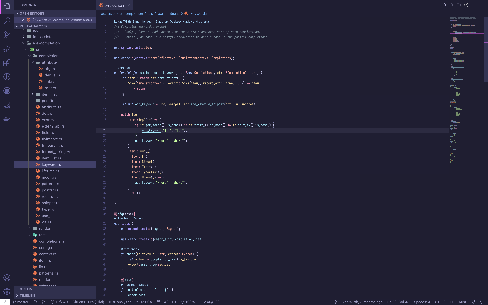

# Night Jellyfish

Dark theme for VSCode inspired by [Night Wolf](https://github.com/mao-santaella-rs/NightWolfTheme)

## Build

Require deno in your machine.

```
deno run -A theme-compiler.ts
```

## Installation

This theme is not yet released at VSCode Marketplace.

If you want to try,

1. Download VSIX file from [GitHub Release](https://github.com/SaiYs/NightJellyfishTheme/releases).

2. Manually install it by

```
code --install-extension myextension.vsix
```

or

`Extensions: Install from VSIX...` in the command palette.

Reference: https://code.visualstudio.com/docs/editor/extension-marketplace#_install-from-a-vsix

## Example



## Colors

### UI

| Base | Accent |
| --- | --- |
| <span style="background-color:#1f1e33">[#1f1e33](https://www.youtube.com/watch?v=w4U9S5eX3eY)</span> | <span style="background-color:#ff50ff">#ff50ff</span> |

### Text

Basic text color

| Text | Comment |
| --- | --- |
| <span style="color:#d1d1f7;background-color:#1f1e33">#d1d1f7</span> | <span style="color:#78909c;background-color:#1f1e33">#78909c</span> |

12 colors for language syntax and semantic highlight

| Red | Orange | Yellow | Lemon | Green | Grass | Teal | Cyan | Blue | Violet | Purple | Magenta |
| --- | --- | --- | --- | --- | --- | --- | --- | --- | --- | --- | --- |
| <span style="color:#ff96b9;background-color:#1f1e33">#ff96b9</span> | <span style="color:#ffa896;background-color:#1f1e33">#ffa896</span> | <span style="color:#ffdc96;background-color:#1f1e33">#ffdc96</span> | <span style="color:#eeff96;background-color:#1f1e33">#eeff96</span> | <span style="color:#b9ff96;background-color:#1f1e33">#b9ff96</span> | <span style="color:#96ffa8;background-color:#1f1e33">#96ffa8</span> | <span style="color:#96ffdc;background-color:#1f1e33">#96ffdc</span> | <span style="color:#96edff;background-color:#1f1e33">#96edff</span> | <span style="color:#96b9ff;background-color:#1f1e33">#96b9ff</span> | <span style="color:#a896ff;background-color:#1f1e33">#a896ff</span> | <span style="color:#dc96ff;background-color:#1f1e33">#dc96ff</span> | <span style="color:#ff96ed;background-color:#1f1e33">#ff96ed</span> |

## Highlighting

- Semantic highlight optimized for Rust, powered by [rust-analyzer](https://rust-analyzer.github.io/manual.html#semantic-syntax-highlighting)

## Contribute

I would like to support semantic highlighting for other languages.
If you are using semantic highlighting in your favorite languages
and want to enable it on this theme,
tell me your setting please! 👀
