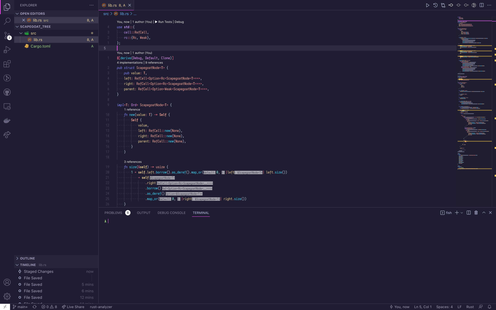

# Night Jellyfish

Dark theme for VSCode based on [Night Wolf](https://github.com/mao-santaella-rs/NightWolfTheme)

## Example

## Features

- Hight contrast cursor color in the editor and terminal
- Semantic highlighting for Rust powered by [rust-analyzer](https://rust-analyzer.github.io/manual.html#semantic-syntax-highlighting)

## Contribute

I would like to support semantic highlighting for other languages.
If you are using semantic highlighting in your favorite languages
and want to enable it on this theme,
tell me your setting please! 👀